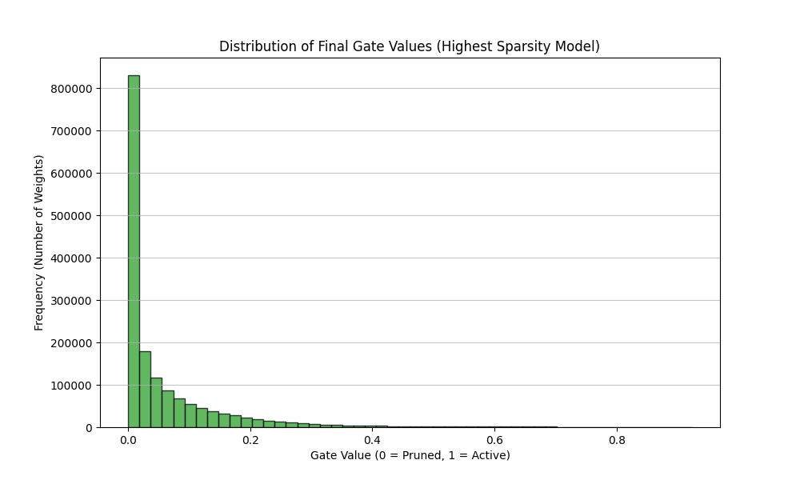
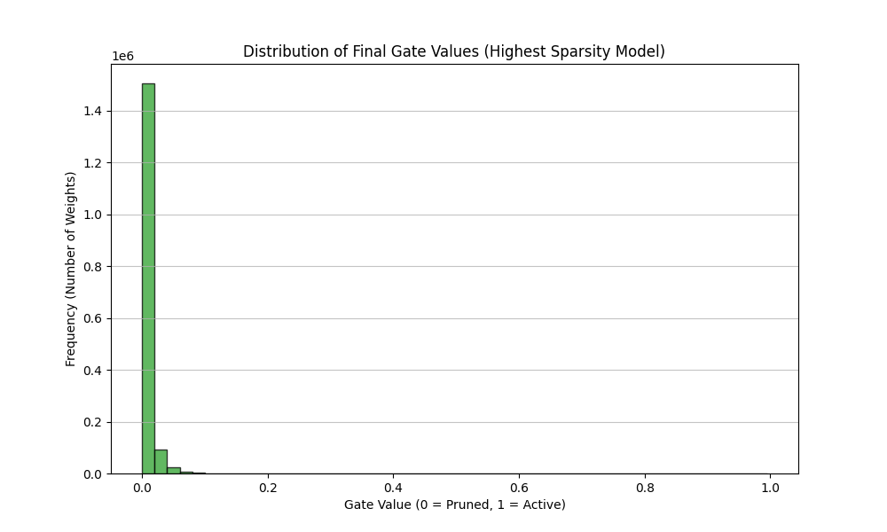
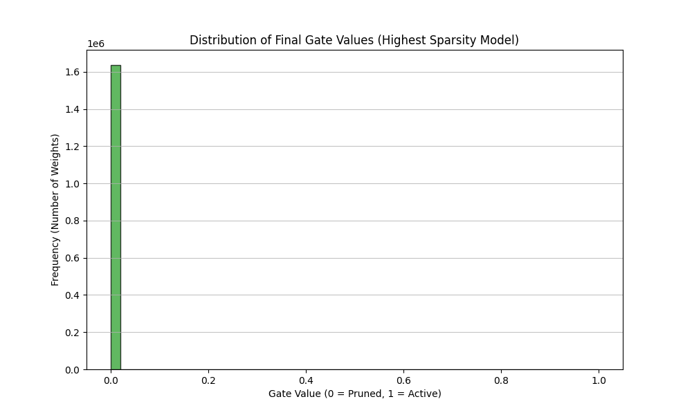

# Self-Pruning Neural Network (CIFAR-10)

This repository contains a PyTorch implementation of a **Self-Pruning Neural Network** designed for the Tredence AI Case Study. The project demonstrates a custom **Prunable Linear Layer** that utilizes a gate-based mechanism to dynamically prune weights during training.

## 1. Architectural Approach
The model is a **Simple Feed-Forward Neural Network (MLP)**. To comply with the constraints of the case study, it avoids complex architectures like CNNs, focusing entirely on the efficiency of the linear connections.

### The Pruning Mechanism
Unlike standard magnitude-based pruning (which happens post-training), this model implements **In-Training Pruning** using a Sigmoid-gated approach:

* **Custom Layer:** Every `PrunableLinear` layer contains a set of trainable `gate_scores` of the same dimension as the weights.
* **Gate Function:** During the forward pass, these scores are passed through a **Sigmoid function** ($\sigma$) to produce a value between 0 and 1.
* **Weight Masking:** The weights are multiplied by these gates: $W_{effective} = W \cdot \sigma(GateScores)$.
* **Sparsity Penalty (L1):** We add an L1 regularization penalty to the total loss function, specifically targeting the gate values. This forces the network to decide which weights are worth the penalty and which should be pushed toward zero (pruned).

## 2. Experimental Results
The model was trained on the CIFAR-10 dataset for **100 epochs** per configuration using an RTX 4050 GPU. We tested three different Sparsity Penalties ($\lambda$) to analyze the trade-off between model complexity and classification performance.

| Lambda ($\lambda$) | Test Accuracy (%) | Sparsity Level (%) | Observation |
|---|---|---|---|
| **0.00001** | 54.96 | 42.76 | Initial reduction of redundant connections. |
| **0.0001** | 53.20 | 81.98 | Significant pruning with minimal accuracy loss. |
| **0.001** | **55.71** | **99.59** | **Optimal Configuration.** Extreme sparsity achieved. |

### Key Insight
At the highest penalty ($\lambda = 0.001$), the model achieved **99.59% sparsity**. Interestingly, the accuracy actually improved to **55.71%**. This suggests the original dense model was over-parameterized, and the extreme sparsity penalty acted as a powerful regularizer, forcing the model to extract only the most critical features to generalize better.

## 3. Pruning Evolution
The following distributions illustrate how the model "self-prunes" as the sparsity penalty increases. The towering spike at 0.0 represents the dead (pruned) weights, while the cluster near 1.0 represents the active "skeleton" network.

| $\lambda = 10^{-5}$ | $\lambda = 10^{-4}$ | $\lambda = 10^{-3}$ |
| :---: | :---: | :---: |
|  |  |  |
| **Sparsity: 42.7%** | **Sparsity: 81.9%** | **Sparsity: 99.6%** |

## 4. How to Run
1.  **Clone the repository:**
    ```bash
    git clone https://github.com/bhathalanmols/Tredence-AI-Case-Study.git
    cd Tredence-AI-Case-Study
    ```
2.  **Install Dependencies:**
    ```bash
    pip install torch torchvision matplotlib numpy
    ```
3.  **Execute the Experiment:**
    ```bash
    python self_pruning_network.py
    ```
    *Note: The script will automatically download the CIFAR-10 dataset if it is not present in the directory.*